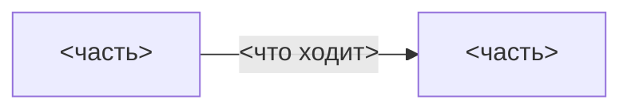
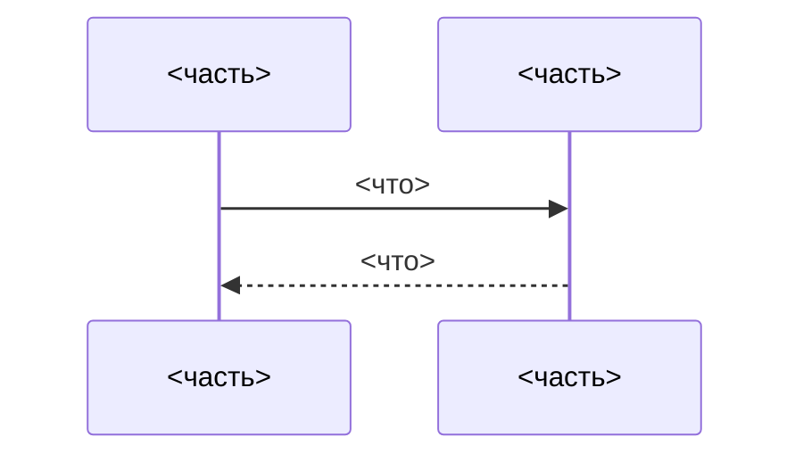

<!--
  PREVIEW TEMPLATE — the SHORT team brief (summary of the sibling <slug>-solution.md).
  Fill every section; delete guidance comments and any section that is genuinely N/A (say why in one line).
  Whole brief must be readable in ~5 minutes: tables and diagrams over prose.

  PHASE RULE: no file-by-file change map, no code, no migration/test plans — this describes the SOLUTION.
  Markers: 🟢 new/decided · 🟡 changed/needs input · 🔴 removed/blocked · ⚠️ attention.
  Badges: 🟢 Ready · 🟡 Needs input · 🔴 Blocked.
  Diagrams are REQUIRED: at least one component view + one flow/sequence view. Keep each to ~10 nodes.
  Russian prose; identifiers, paths, formats and command names verbatim in English.
-->
# <Тема> — Preview для команды

**Статус:** <🟢 Ready / 🟡 Needs input / 🔴 Blocked> · **Границы:** <что покрыто> · **Риск:** <низкий/средний/высокий> · **Ключевое решение:** <одна строка>

> **Что это.** Верхнеуровневое описание решения: из каких частей состоит, как они разговаривают, что между ними
> ходит, что уже решено и что ещё открыто. Реализации пока нет — это база для обсуждения и для последующей
> спецификации, а не план изменений в коде.

---

## 1. Суть

<3–5 предложений: что решаем → как решаем в одном абзаце → главное ограничение. Без деталей, они ниже.>

---

## 2. Из чего состоит

Легенда: 🟢 есть в проекте · 🟡 частично · 🔴 ещё нет

| Часть | За что отвечает | |
|---|---|:--:|
| `<имя>` | <…> | 🔴 |

<⚠️ Отдельной строкой назови связи, которых НЕТ намеренно — читатель домысливает лишние стрелки.>

---

## 3. Как это работает

<Основной путь от начала до конца. Одна диаграмма — sequence, если важен порядок во времени, flowchart, если
важна логика ветвления.>

---

## 4. Форматы

<Только то, что реально зафиксировано: структура ссылки, поля payload с размерами, имена команд/событий.
Таблицей. Если формат не решён — строка с 🟡 и ссылкой на вопрос.>

| Поле | Что | Размер |
|---|---|---|

---

## 5. Решения

| Решение | Выбор | Почему | Пересмотреть, если |
|---|---|---|---|
| <…> | <…> | <…> | <…> |

---

## 6. Пограничные случаи

<Таблицей: ситуация → что происходит. Только те, что меняют дизайн, а не все мыслимые.>

| Случай | Что происходит |
|---|---|

---

## 7. Открытые вопросы и блокеры

<ОБЯЗАТЕЛЬНАЯ секция. 🔴 блокер · 🟡 вопрос · 🟢 принятое допущение. Ссылайся на реестр по id, где он есть.>

| | Вопрос / блокер | На ком | Реестр |
|---|---|---|---|
| 🔴 | <…> | <…> | <Q#> |

---

## 8. Вне скоупа

<Что не покрыто и где живёт вместо этого.>
