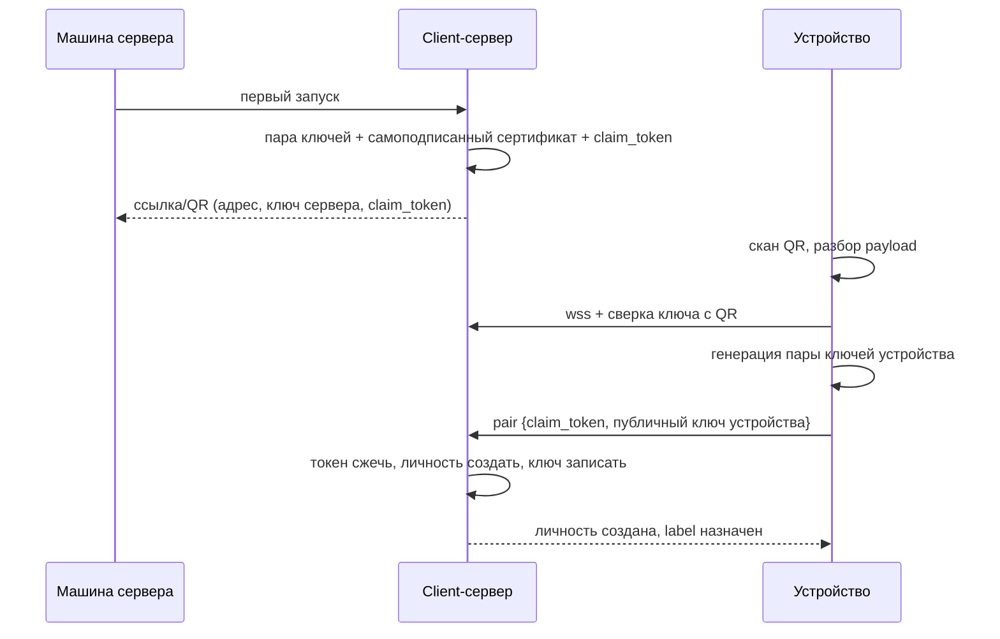
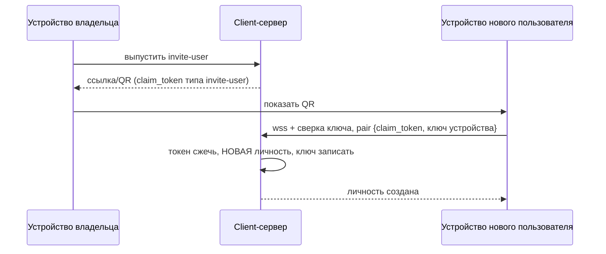
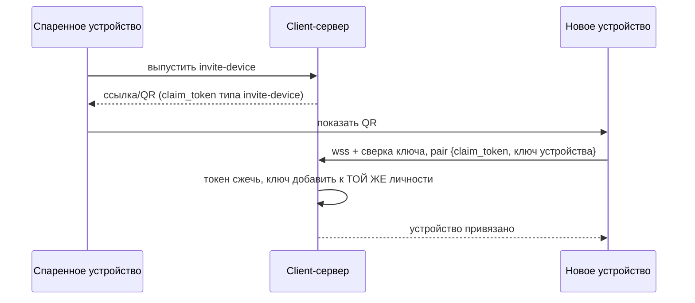
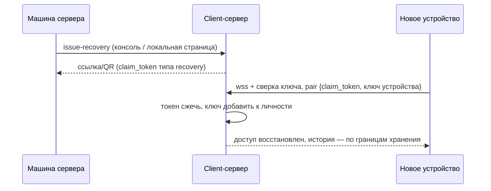
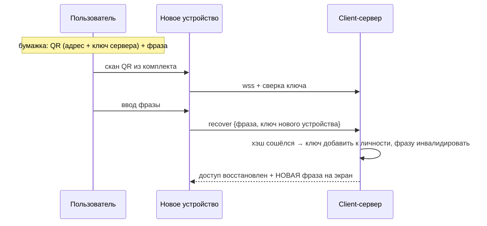
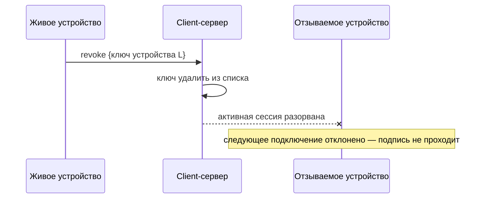
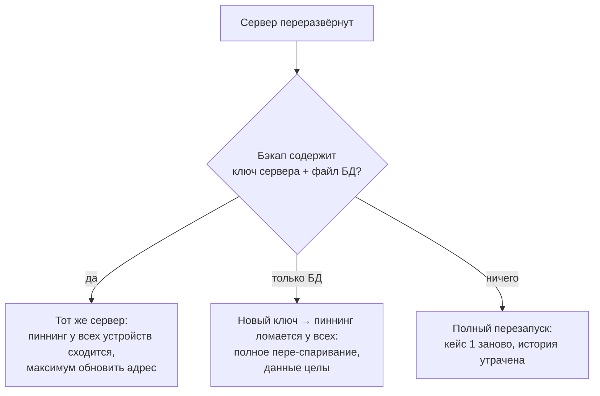

# Аутентификация

**Дата:** 2026-08-14

---

## 1. Основа, общая для всех кейсов

**Один артефакт.** Во всех кейсах, где что-то предъявляется, используется одна и та же ссылка: `https://nox.app/p/#<payload>`. Фрагмент после `#` браузер на сервер не отправляет — payload читает только клиент. QR несёт ту же ссылку целиком. Один парсер, один сканер, один набор тестов.

| Поле | Что | Размер |
|---|---|---|
| `version` | версия формата | 1 байт |
| `port` | порт | 2 байта |
| `host` | адрес (IPv4 / IPv6 / имя — определяется разбором) | переменной длины |
| `server_key` | публичный ключ client-сервера (Ed25519) | 32 байта |
| `claim_token` | одноразовый токен, TTL | 16 байт |

Итого ~55 байт → около 74 символов base64url: QR невысокой плотности, уверенно сканируется с экрана.

**Тип токена в payload не передаётся.** Сервер сам выпустил токен и хранит его тип у себя; при предъявлении токен находится по значению. Кейсы различаются только тем, токен какого типа был выпущен:

| Тип токена | Кейс | Кто выпускает | Что даёт |
|---|:---:|---|---|
| `claim` | 1 | установка сервера | Владение сервером |
| `invite-user` | 2 | владелец сервера | Новая личность в круге этого сервера |
| `invite-device` | 3 | любое спаренное устройство | Новое устройство существующей личности |
| `recovery` | 4 | машина сервера (консоль / локальная страница) | Новое устройство существующей личности без живых устройств |

**Три правила доверия:**

1. **Пиннинг:** приложение всегда сверяет ключ TLS-соединения с ключом из ссылки. Не совпал — обрыв без «продолжить».
2. **Приватные ключи не переезжают.** У каждого устройства своя пара; сервер хранит списки авторизованных публичных ключей. Подключение = подпись challenge'а, а не предъявление секрета.
3. **Машина — корень доверия.** Физический доступ к серверу (или консоль VPS) всегда позволяет выпустить `recovery`-токен. «Админство» — производная от владения машиной, его нельзя потерять безвозвратно, пока машина доступна.

**Автомат состояний сервера:** до первого claim сервер принимает только `claim` и показывает QR; после — `claim` перестаёт действовать навсегда, QR-страница гаснет, работают только остальные три типа.

---

## 2. Карта кейсов

| # | Кейс | Токен | Статус |
|---|---|:---:|:---:|
| 1 | Первичный claim своего сервера | `claim` | 🟢 спроектирован |
| 2 | Новый пользователь в круге | `invite-user` | 🟡 политика приглашений — Q15 |
| 3 | Новое устройство того же пользователя | `invite-device` | 🟡 механизм ясен |
| 4 | Восстановление: живых устройств нет | `recovery` / фраза | 🟡 два пути; формат фразы открыт |
| 5 | Отзыв устройства (logout — частный случай) | — | 🟡 проговорён |
| 6 | Переезд / переустановка сервера | — | 🟡 зависит от бэкапа ключа |

---

## 3. Кейс 1 — первичный claim своего сервера

Пользователь развернул client-сервер и становится его владельцем. Токен рождается вместе с сервером и печатается в вывод установки (облако) или показывается на локальной странице (дом).

⚠️ Ссылка — предъявительская: кто отсканировал первым, тот и владелец. Митигации: короткий TTL, одноразовость, QR-страница только на локальном интерфейсе, после claim повторное владение — только через машину (кейс 4).

---

## 4. Кейс 2 — новый пользователь в круге

Client-сервер обслуживает **круг** — группу людей, общающихся между собой. Владелец добавляет человека в круг: тот получает собственную личность со своим списком устройств.

Приглашение — решение **оператора машины**, не право участников пространства: сервер — это его диск, трафик и юридическая экспозиция. Пространство чатов при этом остаётся открытым для всех — гейтится не «кто может говорить», а «кто живёт на этой машине».

⚠️ Опциональное ужесточение (по образцу связывания устройств WhatsApp): токен срабатывает только после подтверждения на устройстве владельца — перехваченная ссылка сама по себе бесполезна.

---

## 5. Кейс 3 — новое устройство того же пользователя

Телефон уже спарен, подключается десктоп. Приглашение выпускает любое уже спаренное устройство; новое устройство получает **свою** пару ключей, привязанную к той же личности.

⚠️ Глубина истории на новом устройстве зависит от Q1 (полный архив или спул с TTL): при спуле новое устройство видит историю с момента подключения, не всю.

---

## 6. Кейс 4 — восстановление: живых устройств нет

Телефон утерян и был единственным; переустановка приложения — тот же кейс (ключ устройства умер вместе с данными). Личность на сервере цела — нужно лишь заново авторизовать устройство.

### Второй путь: фраза восстановления

При создании личности (в конце кейсов 1 и 2) сервер генерирует **фразу восстановления** — последовательность слов из словаря, которую пользователь записывает. Показывается один раз; приложение просит подтвердить, что фраза сохранена. Механика — отраслевая практика recovery-кодов:

| Правило | Зачем |
|---|---|
| Сервер хранит только **хэш** фразы | Компрометация базы не раскрывает фразу |
| **Одноразовость**: после успешного использования выдаётся новая | Предъявленная фраза считается засвеченной |
| **Rate limit** на попытки | Фразу нельзя перебрать |
| **Ротация** с любого спаренного устройства | Потерял бумажку — перевыпустил, старая мертва |

⚠️ **Фраза сама по себе бесполезна без координат сервера** — новое устройство должно знать, куда подключаться и чей ключ пинить. Поэтому фраза выдаётся в составе **аварийного комплекта**: одна страница для печати/сохранения — QR с адресом и ключом сервера (та же ссылка, без токена) + фраза. Комплект заодно закрывает кейс 6: напоминание о бэкапе файла БД и ключа сервера.

🟡 Открытые детали (Q16): точный формат (число слов), UX подтверждения сохранения, параметры rate limit.

---

## 7. Кейс 5 — отзыв устройства

Планшет продан или утерян — его ключ удаляется из списка авторизованных, и он больше не подключится. Без этого кейса утерянное устройство остаётся дверью навсегда.

**Logout — частный случай:** добровольный отзыв собственного ключа + локальная очистка (она в приложении уже реализована).

---

## 8. Кейс 6 — переезд / переустановка сервера

Диск умер или сервер переезжает на другую площадку. Исход целиком определяется тем, что было в бэкапе:

**Правило для реализации: ключ сервера — обязательная часть бэкапа, наравне с файлом БД.** Вся жизнь сервера — один файл SQLite + пара ключей; аварийный комплект при установке (Q16) покрывает и этот кейс.

🟡 Смена адреса при живом ключе (устройства помнят адрес из ссылки) — механизм обновления адреса не решён.

---

## 9. Открытые вопросы

| | Вопрос | Реестр |
|---|---|---|
| 🟡 | Политика приглашений в круге: только владелец / любой участник / со-владельцы (bus factor) | Q15 |
| 🟡 | Формат фразы восстановления, UX подтверждения, rate limit | Q16 |
| 🟡 | Глубина истории для нового/восстановленного устройства | Q1 |
| 🟡 | Обновление адреса сервера для уже спаренных устройств | — |
| 🟡 | Путь без камеры: ручной ввод или короткий код (у WhatsApp — код из 8 символов) | — |
