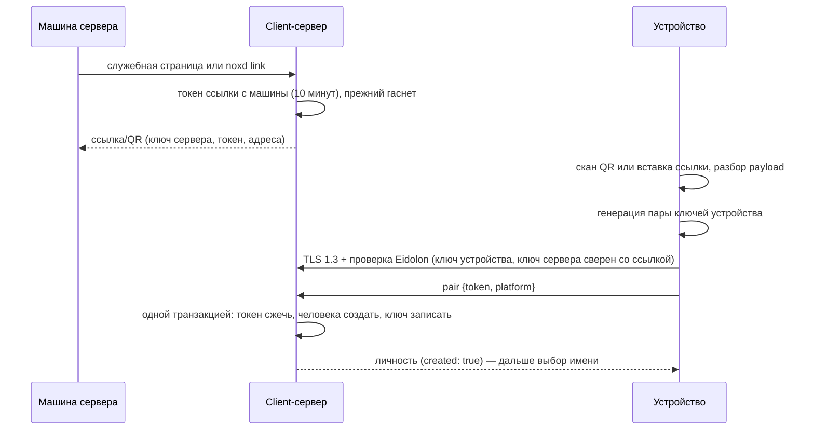
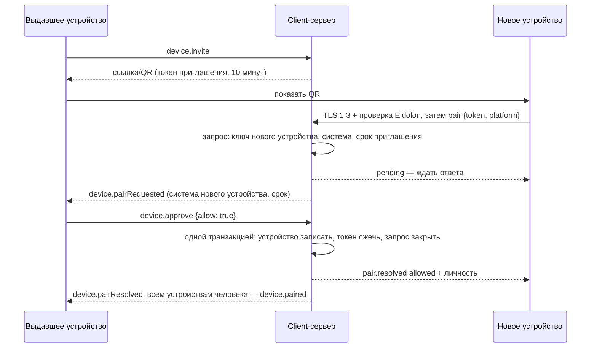
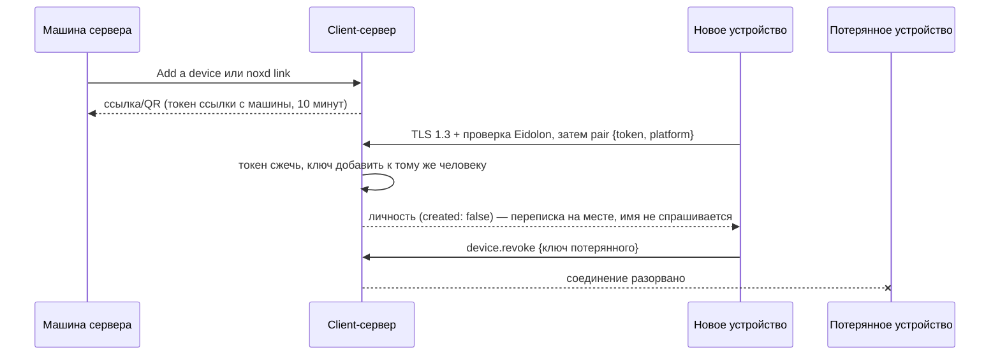
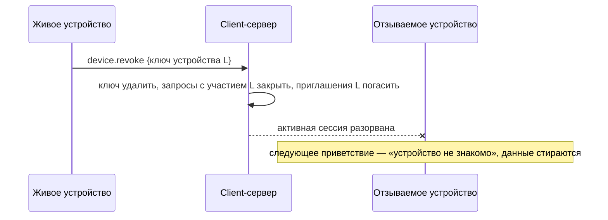
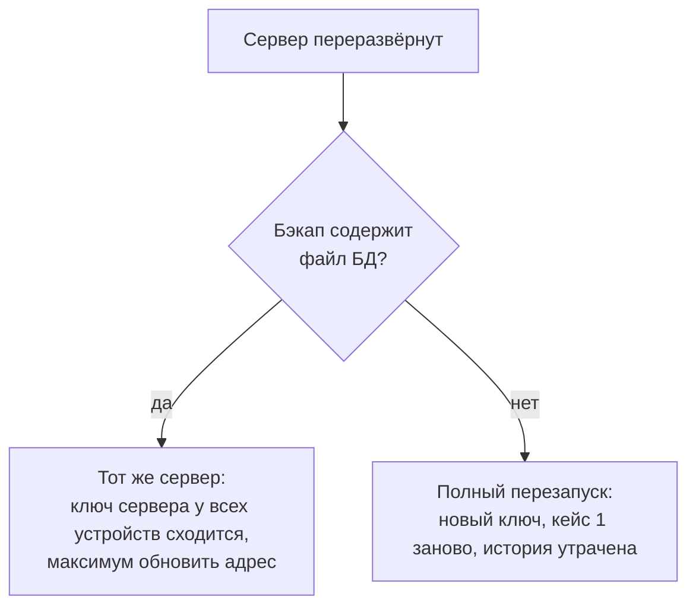

# Аутентификация

Кейсы спаривания и доступа устройств к client-серверу. Модель безопасности целиком — трекер [roadmap-security.md](../roadmap-security.md) (тема 1 — канал, тема 3 — спаривание); провод — контракт §1 и §8A.

**Дата:** 2026-08-14 · ред. 2026-10-10

Client-сервер принадлежит одному человеку и обслуживает только его устройства; всё, что между разными людьми, идёт через relay-сервер ([Q13](../open-questions.md)). Поэтому все кейсы ниже — про **свои** устройства и про саму машину.

---

## 1. Основа, общая для всех кейсов

**Один артефакт.** Во всех кейсах, где что-то предъявляется, используется одна и та же ссылка: `nox://pair/<payload>` (версия 3, контракт §8A). QR несёт ту же ссылку целиком. Один парсер, один сканер, один набор тестов.

| Поле | Что | Размер |
|---|---|---|
| `version` | версия формата, `3` | 1 байт |
| `server_key` | открытый ключ Ed25519 client-сервера — по нему приложение проверяет сервер на каждом соединении | 32 байта |
| `token` | одноразовый токен | 16 байт |
| адреса | публичный (если задан), один прямой и onion (если задан); тип адреса записан явно, неизвестный тип пропускается | переменной длины |

Ссылка с одним адресом IPv4 — 57 байт, около 76 символов base64url: QR невысокой плотности, уверенно сканируется с экрана. Без камеры ссылку вставляют текстом или читают QR-код с картинки; коротких кодов и PIN нет.

**Тип токена в payload не передаётся.** Сервер сам выпустил токен и хранит его тип у себя; при предъявлении токен находится по значению. Видов токена два:

| Токен | Кто выпускает | Срок | Что даёт |
|---|---|---|---|
| **ссылка с машины** | служебная страница или команда `noxd link` — только на машине сервера | 10 минут; живая всегда одна — новая гасит прежнюю | Устройство спаривается сразу: человека на сервере нет — создаёт его, есть — присоединяет к нему со всей перепиской |
| **приглашение** | любое спаренное устройство | 10 минут | Запрос на спаривание: устройство спаривается только после `Allow` на устройстве, выдавшем приглашение |

**Четыре правила доверия:**

1. **Проверка Eidolon на каждом соединении:** поверх TLS 1.3 приложение показывает ключ устройства, сервер — свой, и обе подписи стоят над отпечатком этого соединения (экспортёр TLS 1.3). Ключ сервера приложение сверяет с ключом из ссылки; не совпал — соединение закрывается без «продолжить».
2. **Приватные ключи не переезжают.** У каждого устройства своя пара, новая при каждом спаривании и стираемая при выходе; сервер хранит список спаренных публичных ключей. Подключение = подпись над отпечатком соединения, а не предъявление секрета.
3. **Машина — корень доверия.** Доступ к машине сервера всегда позволяет выпустить ссылку с машины, поэтому потерять доступ к своему серверу безвозвратно, пока машина доступна, нельзя. Отдельного восстановления — фразы, кодов, аварийного комплекта — нет: без устройств право на человека доказывает только доступ к машине. Цена — без живых устройств и без доступа к машине войти нельзя.
4. **Приглашение само ничего не даёт.** Утёкший QR-код приглашения без нажатия `Allow` на устройстве человека бесполезен — а спариваться можно и через onion из любой сети.

**Состояния сервера.** Их два, и различает их число спаренных устройств:

- **устройств нет** — служебная страница сразу показывает ссылку с машины: QR-код, ту же ссылку текстом и срок;
- **устройства есть** — ссылки на странице нет, пока её не попросят кнопкой `Add a device`: просто открытая страница не держит живой ссылки.

Истёкшая ссылка сама себя не перевыпускает: страница показывает `Link expired` и кнопку `New link`. Выход или отзыв последнего устройства возвращает сервер к «устройств нет»; человек и переписка остаются. Ни ссылка, ни токен не пишутся в журнал сервера.

---

## 2. Карта кейсов

Номера кейсов — постоянные идентификаторы: на них ссылаются код и трекеры, поэтому идут они не подряд.

| # | Кейс | Токен |
|---|---|---|
| 1 | Первое устройство | ссылка с машины |
| 3 | Новое устройство того же человека | приглашение с `Allow` — или ссылка с машины |
| 4 | Живых устройств нет | ссылка с машины |
| 5 | Отзыв устройства (выход — частный случай) | — |
| 6 | Переезд / переустановка сервера | — |

---

## 3. Кейс 1 — первое устройство

Человек поставил client-сервер, устройств у него ещё нет. Служебная страница на машине сервера сразу показывает ссылку с машины; на машине без экрана ту же ссылку печатает команда `noxd link`, которая получает её у работающего сервера.

```mermaid
sequenceDiagram
  participant M as Машина сервера
  participant CB as Client-сервер
  participant D as Устройство
  M->>CB: служебная страница или noxd link
  CB->>CB: токен ссылки с машины (10 минут), прежний гаснет
  CB-->>M: ссылка/QR (ключ сервера, токен, адреса)
  D->>D: скан QR или вставка ссылки, разбор payload
  D->>D: генерация пары ключей устройства
  D->>CB: TLS 1.3 + проверка Eidolon (ключ устройства, ключ сервера сверен со ссылкой)
  D->>CB: pair {token, platform}
  CB->>CB: одной транзакцией: токен сжечь, человека создать, ключ записать
  CB-->>D: личность (created: true) — дальше выбор имени
```

⚠️ Ссылка с машины предъявительская: устройство, предъявившее её первым, спаривается без подтверждения. Поэтому она живёт 10 минут, живая всегда одна и выдаётся только на самой машине: служебная страница слушает только loopback, а `noxd link` получает ссылку у работающего сервера через тот же loopback-адрес запросом, который сторонний сайт из браузера отправить не может. В журнал сервера ссылка не попадает.

---

## 4. Кейс 3 — новое устройство того же человека

Телефон уже спарен, подключается ноутбук. Приглашение выпускает любое спаренное устройство; новое устройство получает **свою** пару ключей и присоединяется к тому же человеку — но только после `Allow` на устройстве, выдавшем приглашение.

```mermaid
sequenceDiagram
  participant P as Выдавшее устройство
  participant CB as Client-сервер
  participant N as Новое устройство
  P->>CB: device.invite
  CB-->>P: ссылка/QR (токен приглашения, 10 минут)
  P->>N: показать QR
  N->>CB: TLS 1.3 + проверка Eidolon, затем pair {token, platform}
  CB->>CB: запрос: ключ нового устройства, система, срок приглашения
  CB-->>N: pending — ждать ответа
  CB-->>P: device.pairRequested (система нового устройства, срок)
  P->>CB: device.approve {allow: true}
  CB->>CB: одной транзакцией: устройство записать, токен сжечь, запрос закрыть
  CB-->>N: pair.resolved allowed + личность
  CB-->>P: device.pairResolved, всем устройствам человека — device.paired
```

Выдавшее устройство показывает запрос поверх любого экрана, пока приложение на нём открыто и на связи; о новом устройстве оно узнаёт только семейство системы — без ключа и без модели. Исходы запроса:

| Исход | Когда | Итог |
|---|---|---|
| `allowed` | `Allow` на выдавшем устройстве | новое устройство записано к тому же человеку |
| `denied` | `Deny` — или выдавшее устройство отозвано, пока запрос ждал | ничего не записано |
| `expired` | 10 минут прошли без ответа: сервер закрывает запрос сам | ничего не записано |
| `cancelled` | новое устройство отменило ожидание (`pair.cancel`) | ничего не записано |

Любой исход сжигает токен приглашения; закрытый запрос больше не меняется, и `Allow`, нажатый после, ничего не делает.

- **Обрыв и перезапуск.** События запроса — вне журнала и обрыв не переживают. Новое устройство повторяет `pair` с тем же токеном и тем же ключом и получает тот же запрос — `pending` или записанный исход, — поэтому ожидание переживает обрыв и закрытие приложения в пределах срока; само закрытие приложения запрос не отзывает. Выдавшее устройство после каждого своего приветствия снова получает все ждущие его запросы; пока приложение на нём закрыто, запрос просто ждёт срока — уведомлений нет.
- **Одно приглашение — один запрос.** Тот же токен с другого устройства — отказ `invalid_token`, как для израсходованной ссылки.
- **Без подтверждения** новое устройство добавляет только ссылка с машины: кнопка `Add a device` на служебной странице или `noxd link` (кейс 4).

⚠️ Глубина истории на новом устройстве зависит от Q1 (полный архив или спул с TTL): при спуле новое устройство видит историю с момента подключения, не всю.

---

## 5. Кейс 4 — живых устройств нет

Единственный телефон потерян, или человек вышел из приложения на последнем устройстве; переустановка приложения — тот же кейс: ключ устройства пропал вместе с данными. Человек и переписка на сервере целы — нужно спарить новое устройство. Путь один — ссылка с машины: служебная страница показывает её сразу, если спаренных устройств не осталось, и по кнопке `Add a device`, если потерянные ещё числятся спаренными; на машине без экрана — `noxd link`.

```mermaid
sequenceDiagram
  participant M as Машина сервера
  participant CB as Client-сервер
  participant N as Новое устройство
  participant L as Потерянное устройство
  M->>CB: Add a device или noxd link
  CB-->>M: ссылка/QR (токен ссылки с машины, 10 минут)
  N->>CB: TLS 1.3 + проверка Eidolon, затем pair {token, platform}
  CB->>CB: токен сжечь, ключ добавить к тому же человеку
  CB-->>N: личность (created: false) — переписка на месте, имя не спрашивается
  N->>CB: device.revoke {ключ потерянного}
  CB--xL: соединение разорвано
```

Отдельного восстановления нет — ни фразы, ни кодов, ни аварийного комплекта: тот, кто может выпустить ссылку с машины, и так держит машину вместе с базой. Потерянные устройства отзывает новое из своего списка устройств; со служебной страницы отзыва нет.

---

## 6. Кейс 5 — отзыв устройства

Планшет продан или потерян — его ключ удаляется из списка спаренных, и он больше не подключится. Отозвать можно с любого спаренного устройства. Без этого кейса утерянное устройство остаётся дверью навсегда.

```mermaid
sequenceDiagram
  participant P as Живое устройство
  participant CB as Client-сервер
  participant L as Отзываемое устройство
  P->>CB: device.revoke {ключ устройства L}
  CB->>CB: ключ удалить, запросы с участием L закрыть, приглашения L погасить
  CB--xL: активная сессия разорвана
  Note over L: следующее приветствие — «устройство не знакомо», данные стираются
```

- Соединения отозванного устройства рвутся сразу, а не при следующей попытке. Отозванное устройство неотличимо от незнакомого — так же для устройства выглядит и пересобранный сервер, и в обоих случаях оно стирает свои данные и возвращается к спариванию.
- Вместе с устройством закрываются запросы, в которых оно участвует (`denied`), и гаснут непредъявленные приглашения, которые оно выпустило: ссылка от устройства, которому только что велели уйти, не должна просить остальные устройства о чём-либо.
- **Выход — частный случай:** устройство отзывает свой ключ, затем стирает данные и ключ у себя. Без связи стирание безусловно, а оставшийся ключ отзывают с другого устройства.
- **Последнее устройство.** Отзыв или выход последнего возвращает сервер к «устройств нет»: служебная страница сразу показывает ссылку с машины, и устройство по ней присоединяется к тому же человеку со всей перепиской (кейс 4).

---

## 7. Кейс 6 — переезд / переустановка сервера

Диск умер или сервер переезжает на другую площадку. Исход целиком определяется тем, что было в бэкапе:

```mermaid
flowchart TB
  A["Сервер переразвёрнут"] --> B{"Бэкап содержит<br/>файл БД?"}
  B -->|"да"| C["Тот же сервер:<br/>ключ сервера у всех устройств сходится,<br/>максимум обновить адрес"]
  B -->|"нет"| E["Полный перезапуск:<br/>новый ключ, кейс 1 заново, история утрачена"]
```

**Ключ сервера лежит внутри файла базы**, поэтому бэкап базы оставляет сервер тем же для всех устройств: «бэкап только базы» не может оставить сервер без его ключа. Замены ключа без переспаривания нет: утечка ключа или потеря базы — новый ключ, и все устройства спариваются заново.

Новые адреса машины устройство узнаёт после подключения — в ответе на приветствие и событием `server.addresses` (контракт §3); если ни один известный адрес не отвечает, адрес сервера правят в настройках связи приложения.

---

## 8. Открытые вопросы

| | Вопрос | Реестр |
|---|---|---|
| 🔴 | Протокол между client-сервером и relay: без него общения между разными людьми не существует | Q13 |
| 🟡 | Глубина истории для нового устройства | Q1 |
