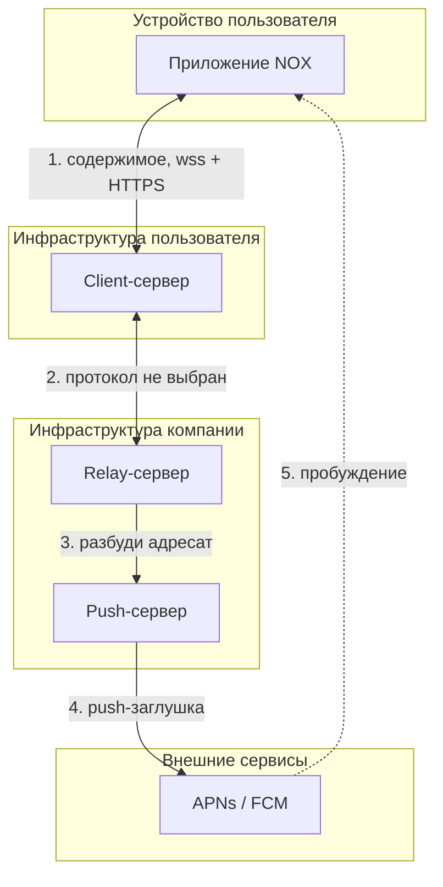
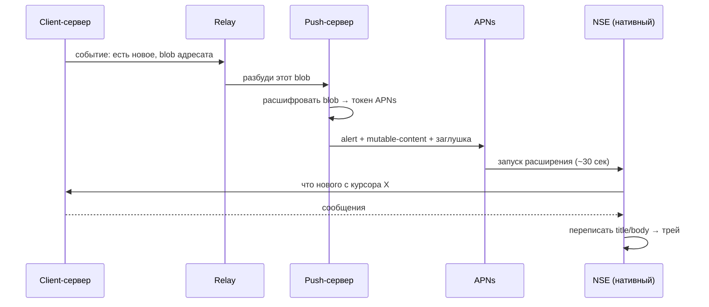
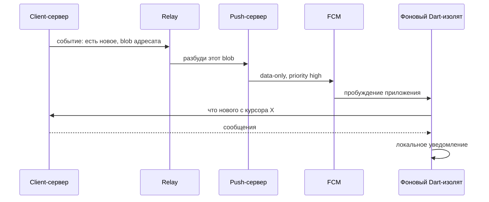
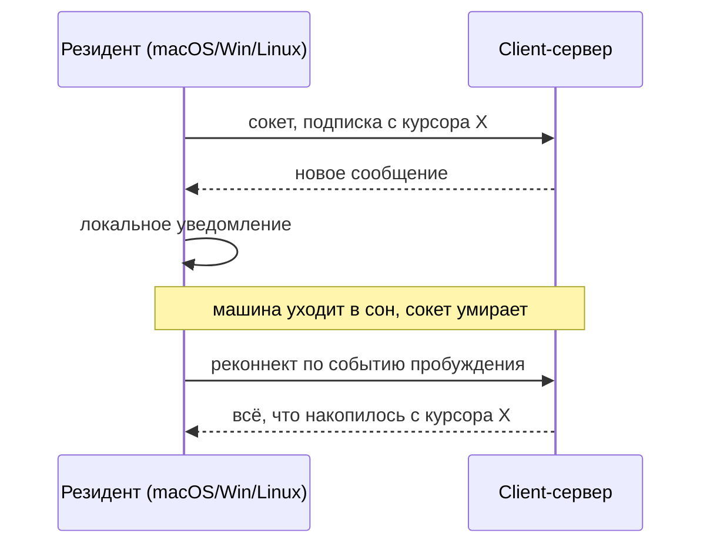
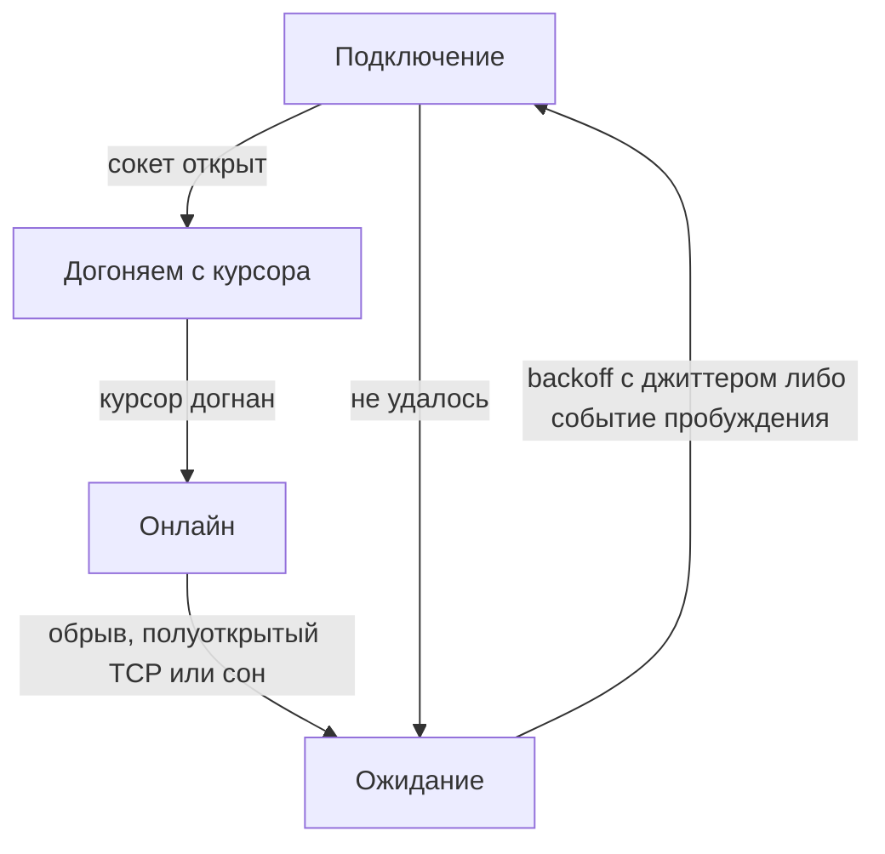

# Доставка уведомлений — архитектура

**Дата:** 2026-08-16 · **Для кого:** бэкенд-разработчики и члены команды, которым нужно верхнеуровневое понимание того, что куда ходит.

Основано на [notification-delivery-solution.md](../preview/notification-delivery/notification-delivery-solution.md) — там обоснования, первоисточники и отвергнутые варианты. Здесь только схема работы.

⚠️ **Протокол «приложение ↔ client-сервер» и «client-сервер ↔ relay» ещё не выбран** (Q13). Поэтому пакеты на этих участках описаны **по смыслу**, а не по байтам. Форматы APNs и FCM, наоборот, заданы Apple и Google и приведены буквально.

---

## 1. Действующие лица

| Компонент | Чей | За что отвечает |
|---|---|---|
| **Приложение** | устройство пользователя | Показывает уведомление, ведёт догоняющую синхронизацию |
| **Client-сервер** | пользователь, разворачивает сам | Хранит сообщения, отдаёт «что нового с курсора X», сообщает наверх о событии |
| **Relay-сервер** | компания | Связывает client-серверы между собой. Про push знает только «надо разбудить вот этот непрозрачный адресат» |
| **Push-сервер** | компания, **отдельно от relay** | Единственный держатель ключей APNs и FCM. Больше не делает ничего |
| **APNs / FCM** | Apple / Google | Переносят сигнал пробуждения |

---

## 2. Топология



**Три границы, которые нельзя перепутать:**

- Приложение разговаривает **только со своим client-сервером**. Ни про relay, ни про push-сервер оно не знает и адресов их не имеет.
- **Содержимое** ходит исключительно по стрелке 1. По стрелкам 3–5 не идёт ничего, кроме факта «разбуди».
- Стрелка 5 — пунктиром, потому что доставка best-effort: гарантии нет (см. §7).

---

## 3. Почему push-сервер отделён от relay

Разделение сделано ради операционной развязки: relay не зависит от инфраструктуры Apple и Google, а push-сервер не знает ничего о смысле сообщений.

| | Токен устройства | Что произошло | Содержимое |
|---|:---:|:---:|:---:|
| **Client-сервер** | 🔒 только в зашифрованном виде | 🟢 да | 🟢 да |
| **Relay-сервер** | 🔴 **нет**, непрозрачный blob | 🟡 факт и время | 🔴 нет |
| **Push-сервер** | 🟢 да, расшифровывает | 🔴 **нет** | 🔴 нет |
| **APNs / FCM** | 🟢 да | 🔴 нет | 🔴 нет |

---

## 4. Платформы: три разных пути

| | Как будим | Кто идёт за содержимым | Кто рисует уведомление |
|---|---|---|---|
| **iOS** | alert-push с `mutable-content` | Notification Service Extension, **нативный Swift** | iOS, подменённым текстом |
| **Android** | data-only FCM, high priority | фоновый Dart-изолят | приложение, локальное уведомление |
| **Десктопы** | ничем: резидент сам висит на сокете | сам резидент по сокету | приложение, локальное уведомление |

**Терминология.** «Push-заглушка» — это alert-push, в теле которого лежит строка-заглушка вместо содержимого. Это **не** silent push: silent (`content-available`) не запускает расширение, троттлится и не доживает до force-quit. Различие критично, см. §5.

На десктопах push существует (APNs на macOS, WNS на Windows), но не используется — §7.

---

## 5. iOS



🔴 **Если шаг «что нового» не уложился в ~30 секунд или сервер недоступен** — iOS показывает заглушку из payload. Она и есть UX отказа, поэтому её текст выбирается осознанно (у Signal — «You may have new messages»).

⚠️ Расширение — **отдельный нативный процесс, Dart в нём не работает**. Клиентская часть протокола и криптоядро должны быть вызываемы из Swift (Q10).

⚠️ **Слать надо именно alert, а не silent.** Расширение запускается только когда выполнены *оба* условия: уведомление настроено показывать alert **и** в `aps` есть `mutable-content: 1`. Silent-push (`content-available`) расширение не запускает, троттлится и **не доставляется после force-quit** — то есть на нём мессенджер не строится.

---

## 6. Android



⚠️ Сообщение должно быть **data-only**: если положить в него блок `notification`, FCM в фоне отдаст его прямо в трей и наш код не вызовет — содержимое взять будет неоткуда.

⚠️ FCM понижает приоритет отправителям, чьи push систематически не заканчиваются видимым уведомлением (окно — скользящие 7 дней). Схема безопасна ровно потому, что уведомление в итоге показывается.

---

## 7. Десктопы — постоянный сокет вместо push

**Нативный push на десктопах не используем.** Он закрывает единственный сценарий — полностью закрытое приложение, — а стоит непропорционально: техническая сложность, интеграция со сторонними сервисами и их учётными записями, нативный код вне Flutter. Уведомления обеспечивает резидентный процесс с постоянным сокетом.

| ОС | Push существует? | Чего стоит разбудить им **закрытое** приложение |
|---|:---:|---|
| **macOS** | 🟢 APNs, в том числе для Developer ID вне App Store | Задокументированного способа разбудить незапущенное обычное приложение нет. `UNNotificationServiceExtension` числится доступным с 10.14, но how-to Apple macOS не упоминает ни разу, а разработчики с 2021 по 2025 сообщают, что он либо не вызывается, либо убивается на старте |
| **Windows** | 🟢 WNS, тип **raw** — это ровно пинг без содержимого | Нужен package identity: sparse-пакет с подписанным MSIX-манифестом, регистрация в Microsoft Entra ID (Partner Center не поддерживается), письмо в Microsoft на сопоставление PFN→AppId, нативный код на C++/WinRT — Flutter-плагина не существует. **Энергосбережение отключает приём push целиком**, и прочитать состояние этой настройки нельзя |
| **Linux** | 🔴 OS-уровневого нет | UnifiedPush — D-Bus-конвенция поверх чужого постоянного соединения, а не канал ОС. Нужен дистрибьютор, который пользователь ставит руками; ни один дистрибутив не ставит его по умолчанию |

Так же устроены все восемь разобранных десктопных клиентов (Signal, Element, Telegram, WhatsApp, Wire, Threema, Delta Chat, SimpleX): **ни один не использует вендорский push на десктопе**, все держат собственное постоянное соединение.

⚠️ **Принятое следствие:** при полностью закрытом приложении уведомления на десктопе не приходят до перезапуска. Закрывается треем и автозапуском — так же, как у всех перечисленных.



Состояния, которые должен реализовать клиент:



| ОС | Автозапуск | Событие пробуждения |
|---|---|---|
| **macOS** | `SMAppService` | `NSWorkspace.didWakeNotification` |
| **Windows** | Task Scheduler по входу в систему | `PBT_APMRESUMEAUTOMATIC` |
| **Linux** | systemd user unit, `Restart=always` | D-Bus `PrepareForSleep(false)` |

🟡 **Windows:** в Modern Standby на батарее сетевой стек сам отключает Wi-Fi и Ethernet — сокет не живёт, уведомления приезжают при пробуждении. На зарядке живёт.

---

## 8. Какие пакеты ходят

| # | Откуда → куда | Когда | Что внутри | Чего внутри **нет** |
|---|---|---|---|---|
| 1 | Приложение → **свой** Client-сервер | первый запуск и ротация токена | Токен устройства, **зашифрованный ключом push-сервера**; тип платформы | — |
| 2 | Client-сервер → Relay | появилось новое для устройства | Непрозрачный blob адресата; тип платформы | Текст, отправитель, имя чата |
| 3 | Relay → Push-сервер | немедленно | Команда «разбуди»; тот же blob | Что произошло, от кого |
| 4 | Push-сервер → APNs / FCM | немедленно | См. ниже — формат задан вендором | Любое содержимое |
| 5 | APNs / FCM → устройство | best-effort | То же | — |
| 6 | Устройство → **свой** Client-сервер | после пробуждения | «Что нового с курсора X» | — |
| 7 | Client-сервер → устройство | в ответ | Сообщения | — |

Участки **1, 6, 7** — наш протокол, ещё не выбран. Участок **2** — Q13. Участки **4–5** зафиксированы вендорами:

**iOS (APNs)** — обязательны *оба* условия, иначе расширение не запустится:

```
POST /3/device/<token>
apns-push-type: alert
apns-priority: 10
apns-topic: <bundle id>

{ "aps": { "alert": { "body": "<заглушка>" },
           "mutable-content": 1 } }
```

**Android (FCM)** — блока `notification` быть не должно:

```
POST /v1/projects/<id>/messages:send

{ "message": { "token": "<token>",
               "android": { "priority": "high" },
               "data": { "v": "1" } } }
```

---

## 9. Что из этого следует для бэкенда

**Client-сервер обязан:**

1. Отдавать **«что изменилось с курсора X»**, а не «последние N сообщений». Это не удобство, а необходимость: и десктоп после сна, и мобильный после пропущенного push догоняют именно так. Модель «отдай последнее» будет терять либо дублировать.
2. Хранить зашифрованный токен устройства, не пытаясь его прочитать.
3. Порождать событие наверх при появлении нового — по одному на устройство-адресат.

**Push-сервер обязан:**

1. Быть единственным местом, где лежат ключи APNs и FCM. **Не копировать их в client-серверы** — обладатель ключа может слать push всем пользователям NOX.
2. Расшифровывать blob и вызывать нужного вендора по типу платформы.
3. Не хранить ничего о смысле события.

**Общее правило, вытекающее из отсутствия гарантий доставки:**

> **Уведомление — это оптимизация, а не транспорт.** Единственный гарантированный момент синхронизации — когда пользователь сам открыл приложение. Пропущенный push не должен означать потерянное сообщение.

---

## 10. Открытые вопросы

| | Вопрос | Реестр |
|---|---|---|
| 🔴 | Язык и форма криптоядра — должно вызываться из Swift внутри расширения | Q10 |
| 🟡 | Как устройство регистрирует токен и как ключ push-сервера попадает на устройство | открыт, отдельно |
| 🟡 | Протокол «client-сервер ↔ relay» | Q13 |
| 🟡 | ATS и самоподписанные пользовательские серверы на iOS | Q14 |
| 🟡 | Текст заглушки в payload — его видит пользователь при отказе | — |
| 🟡 | Windows: MSIX ради тостов и `SocketActivityTrigger` | — |
