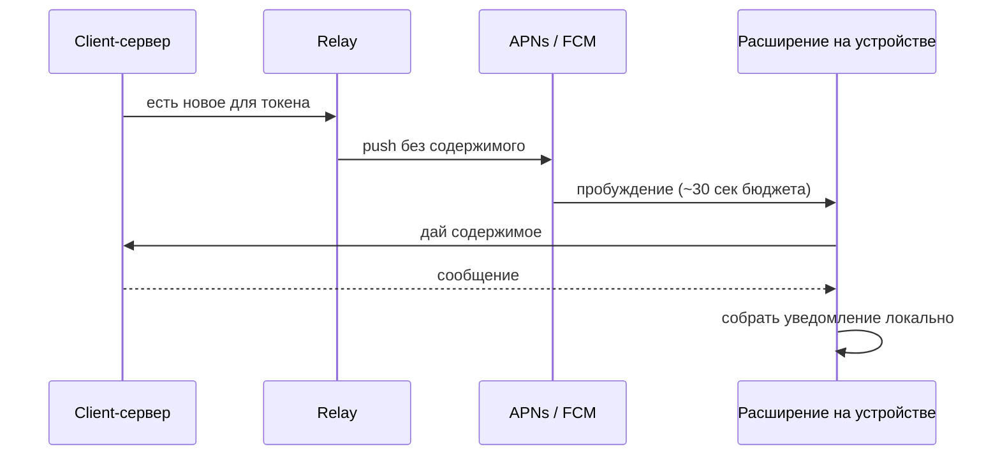

# Доставка уведомлений о новых сообщениях

---

## 1. Суть

Нужно сообщать пользователю о новых сообщениях, **не пропуская содержимое через инфраструктуру Google и Apple**, и при этом показывать в трее нормальное уведомление, а не строку «у вас что-то есть».

Решение: **push используется как звонок в дверь**. Через APNs/FCM летит только сигнал пробуждения, без единого байта содержимого. Разбуженное приложение идёт **в свой client-сервер**, забирает данные и собирает уведомление локально. Google и Apple переносят только пинг.

Главное ограничение оказалось не в push. На iOS содержимое забирает **Notification Service Extension** — отдельный нативный процесс, в котором **Flutter и Dart не работают**. Значит протокол и криптоядро должны быть вызываемы из Swift, и это требование приходит на выбор языка **сейчас**, а не после.

---

## 2. Из чего состоит

Легенда: 🟢 есть в проекте · 🟡 частично · 🔴 ещё нет

| Часть | За что отвечает | |
|---|---|:--:|
| Client-сервер | Хранит сообщения, отдаёт содержимое разбуженному клиенту | 🔴 |
| Relay-сервер | Единственный, кто держит ключи APNs и FCM и шлёт сигнал пробуждения | 🔴 |
| APNs / FCM | Переносят **только** пинг. Содержимого не видят | 🟢 внешние |
| Notification Service Extension (iOS) | Нативное расширение: fetch содержимого и подмена уведомления | 🔴 |
| Криптоядро, вызываемое из Swift | Тот же протокол и шифрование, что в приложении, но доступные расширению | 🔴 |
| Приложение | Показывает уведомление, ведёт сокет там, где он возможен | 🟢 |

⚠️ Содержимое ходит **только по прямой связи с собственным client-сервером**. По стрелкам через relay и APNs/FCM не идёт ничего, кроме факта «разбуди этот токен».

---

## 3. Как это работает

🔴 Если fetch не уложился или сервер недоступен — iOS показывает **исходный payload**. Значит текст в пустом push **и есть** сообщение об ошибке: у Signal это «You may have new messages».

---

## 4. Можно ли поднять процесс, который сам проверяет обновления

| | iOS | Android | macOS | Windows | Linux |
|---|:---:|:---:|:---:|:---:|:---:|
| **Push-звонок + fetch** | 🟢 **да** | 🟢 **да** | 🟡 частично | 🔴 push-пути нет | 🔴 push-пути нет |
| **Постоянный сокет** | 🔴 **невозможно** | 🟢 да, с оговорками | 🟢 да | 🟡 ломает Modern Standby | 🟢 да |
| **Опрос по таймеру** | 🔴 невозможно | 🟡 15 мин, деградирует до суток | 🟢 да | 🟢 да | 🟢 да |

**Рекомендация:** push-звонок на iOS и Android, постоянный сокет на macOS, Windows и Linux — там push-пути нет вовсе, а сокет ничего не стоит.

### Почему опрос по таймеру закрыт

| Платформа | Что мешает |
|---|---|
| **iOS** | Apple: механизма периодического выполнения **нет**. Фоновое обновление даёт ~30 сек без гарантий, редко открываемое приложение может **не получить времени вообще**, после свайпа из переключателя не срабатывает ничего |
| **Android** | Пол — 15 минут, не 5. Но связывает не интервал, а корзины App Standby: в Rare — 10 минут работы **на сутки и сеть отключена**; 8 дней без запуска → Restricted |
| Десктопы | Работает, но там дешевле держать сокет |

### Постоянный сокет — цена

| Платформа | | Что именно |
|---|:---:|---|
| **iOS** | 🔴 | Механизма нет. Apple дословно: «There's no good way to do this on iOS». Фоновая задача — ~30 секунд |
| **Android** | 🟢 | Foreground-сервис с **постоянным уведомлением**. Тип обязателен `remoteMessaging`: у `dataSync` потолок 6 часов в сутки. Пользователь может остановить сервис кнопкой, OEM-прошивки убивают. ⚠️ Google помечает мессенджер, **способный** использовать FCM, как «Not Acceptable» для исключения из оптимизации батареи |
| **macOS / Linux** | 🟢 | Резидент в меню-баре или systemd user unit. Проще всего |
| **Windows** | 🟡 | Резидент в трее, но **Modern Standby на батарее** рвёт соединение |

Инженерия реконнектов, которую придётся написать: keepalive под самый агрессивный NAT (сотовые сбрасывают простой за ~30 сек), детект полуоткрытого TCP (соединение выглядит живым, данные не идут), backoff **с джиттером** (иначе перезапуск сервера соберёт лавину), переживание смены Wi-Fi ↔ сотовой.

**Батарея — честно: современного контролируемого измерения нет**, а цифры из открытых источников при проверке не подтвердились. Косвенный признак сильнее цифр: Signal гасит свой сокет через 2 минуты с комментарием в коде «Higher numbers allow us to rely on FCM less».

---

## 5. Решения

| Решение | Выбор | Почему | Пересмотреть, если |
|---|---|---|---|
| Что летит через APNs/FCM | Только сигнал пробуждения | Снимает возражение: содержимое туда не попадает | — |
| Тип push на iOS | `alert` + `mutable-content: 1` | Только он запускает расширение. Silent push throttled до 2–3/час и **отбрасывается после force-quit** | — |
| Тип сообщения на Android | data-only, высокий приоритет | `notification`-сообщение в фоне идёт прямо в трей и код не вызывает | — |
| Опрос по таймеру | Отклонён | На iOS невозможен, на Android деградирует до суток | Apple введёт гарантированный интервал |
| Сокет на мобильных | Не основной путь | На iOS невозможен, на Android — policy-риск и постоянное уведомление | — |

---

## 6. Пограничные случаи

| Случай | Что происходит |
|---|---|
| Приложение убито свайпом (iOS) | Расширение **всё равно запускается** — это подтверждает инженер Apple DTS. Опрос и silent push здесь не работают |
| Расширение не уложилось в ~30 сек | Показывается исходный payload — та самая строка-заглушка |
| Client-сервер недоступен | То же самое: заглушка вместо содержимого |
| Уведомление не показано (Android) | FCM понижает приоритет приложениям, чьи push не заканчиваются видимым уведомлением. Наша схема безопасна: уведомление показывается |
| Windows на батарее | Modern Standby рвёт сокет — 🔴 не решено, нужен либо реконнект по пробуждению, либо принятие задержки |
| Сборки без Google Play | Push-пути нет — 🔴 не решено, отдельная оценка |

---

## 7. Открытые вопросы и блокеры

| | Вопрос / блокер | На ком | Реестр |
|---|---|---|---|
| 🔴 | **Язык и форма криптоядра**: оно должно вызываться из Swift внутри расширения, где нет Flutter. Это второй жёсткий таргет вдобавок к Android — оба указывают на переносимое ядро, а не на Dart | владелец + архитектура | Q10 |
| 🟡 | ATS и **самоподписанные** пользовательские серверы: что объявлять в `Info.plist` и как это пройдёт App Review | архитектура | — |
| 🟡 | Нужен ли ограниченный entitlement `usernotifications.filtering`, чтобы **скрывать** уведомление при провале fetch. Есть у Signal и Wire, запрашивается у Apple | владелец | — |
| 🟡 | Какую строку писать в пустой push — её увидит пользователь при недоступном сервере | владелец | — |
| 🟡 | Держать ли свой сокет на Android вопреки рекомендации Google | владелец | — |
| 🟢 | Содержимое через каналы Google и Apple не проходит — возражение снято | решено | Q2 |
