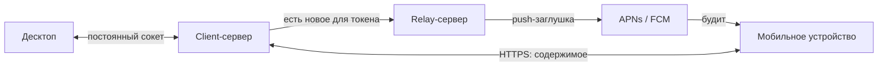
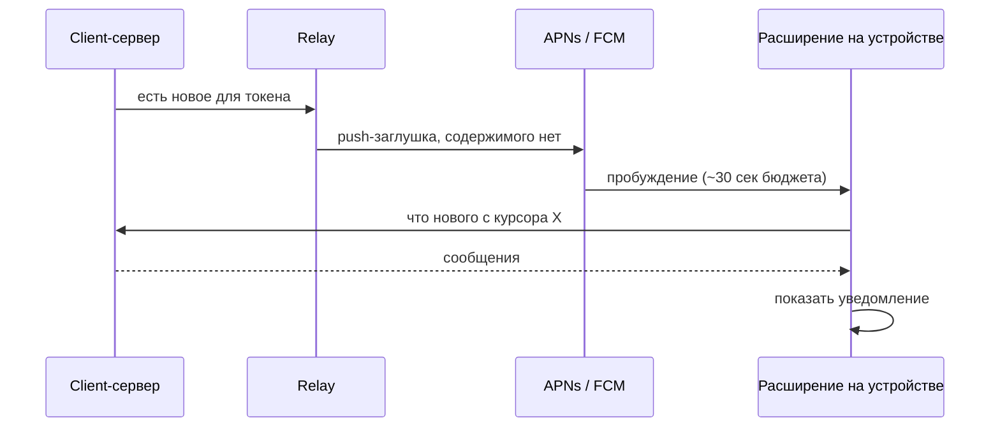

# Доставка уведомлений о новых сообщениях

---

## 1. Суть

Нужно сообщать пользователю о новых сообщениях, **не пропуская содержимое через инфраструктуру Google и Apple**, и при этом показывать в трее нормальное уведомление, а не строку «у вас что-то есть».

Решение: **push-заглушка, звонок в дверь**. Через APNs/FCM летит только сигнал пробуждения, без единого байта содержимого. Разбуженное приложение идёт **в свой client-сервер**, забирает данные и собирает уведомление локально. Google и Apple переносят только пинг.

На мобильных push — единственный работающий триггер. На десктопах push **существует** (APNs на macOS, WNS на Windows), но решением владельца не используется: там можно держать обычный фоновый процесс с постоянным сокетом, а разбудить push-ом закрытое приложение стоит непропорционально дорого.

Главное ограничение оказалось не в push. На iOS содержимое забирает **Notification Service Extension** — отдельный нативный процесс, в котором **Flutter и Dart не работают**. Значит протокол и криптоядро должны быть вызываемы из Swift, и это требование приходит на выбор языка **сейчас**, а не после.

---

## 2. Из чего состоит

Легенда: 🟢 есть в проекте · 🟡 частично · 🔴 ещё нет

| Часть | За что отвечает | |
|---|---|:--:|
| Client-сервер | Хранит сообщения, отдаёт «что нового с курсора X» | 🔴 |
| Relay-сервер | Единственный, кто держит ключи APNs и FCM и шлёт сигнал пробуждения | 🔴 |
| APNs / FCM | Переносят **только** пинг. Содержимого не видят | 🟢 внешние |
| Notification Service Extension (iOS) | Нативное расширение: fetch содержимого и подмена уведомления | 🔴 |
| Криптоядро, вызываемое из Swift | Тот же протокол и шифрование, что в приложении, но доступные расширению | 🔴 |
| Резидент на десктопах | Держит сокет, переподключается после сна | 🔴 |
| Приложение | Показывает уведомление, ведёт догоняющую синхронизацию | 🟢 |

⚠️ Содержимое ходит **только по прямой связи с собственным client-сервером**. По стрелкам через relay и APNs/FCM не идёт ничего, кроме факта «разбуди этот токен».

---

## 3. Как это работает на мобильных

🔴 Если fetch не уложился или сервер недоступен — iOS показывает **исходный payload**. Значит текст заглушки **и есть** сообщение об ошибке: у Signal это «You may have new messages».

---

## 4. ⚠️ Важная поправка: silent push — не тот механизм

План «получаем **silent** push → идём на бэкенд → показываем локальное уведомление» **на Android верен буквально**. **На iOS — нет**, и это самая частая ошибка в этой области.

| Тип push на iOS | Что запускает | Переживает force-quit | Троттлинг |
|---|---|:--:|:--:|
| **alert + `mutable-content: 1`** | **Notification Service Extension** | 🟢 **да** | 🟢 нет |
| silent (`content-available: 1`) | фоновый обработчик приложения | 🔴 **нет** | 🔴 **да, ~2–3/час** |

**Нужный UX достигается, просто другим механизмом.** Релей шлёт alert-push с заглушкой в теле; iOS **до показа чего-либо** запускает расширение; расширение идёт в свой client-сервер и **переписывает** текст уведомления. Пользователь не отличит это от локального уведомления.

Три отличия от исходного плана, которые надо принять:

| | Что именно |
|---|---|
| 🟡 | Это не локальное уведомление, а тот же push с подменённым содержимым — `flutter_local_notifications` на iOS не участвует |
| 🟡 | Слот в трее резервируется заранее: «сходить, посмотреть и ничего не показать» требует ограниченного entitlement `usernotifications.filtering` (есть у Signal и Wire) |
| 🔴 | Расширение — нативный процесс, Dart в нём не запускается |

**Следствие:** одинаковой реализации на двух мобильных платформах не будет. Android — на Dart, iOS — нативно на Swift.

---

## 5. Десктопы: сокет вместо push

На десктопе **можно держать обычный процесс, стартующий при входе в систему**, — нет ни Doze, ни App Standby, ни 30-секундного бюджета. Сон машины не блокер, а инженерная задача из трёх частей, одинаковая для всех трёх ОС: **автозапуск** → **хук на пробуждение** → **догоняющая синхронизация**.

| | Автозапуск | Реконнект после сна | Уведомления |
|---|---|---|---|
| **macOS** | `SMAppService` | `NSWorkspace.didWakeNotification` | `UNUserNotificationCenter` |
| **Windows** | Task Scheduler по входу в систему | `PBT_APMRESUMEAUTOMATIC` | Toast (⚠️ часть функций требует MSIX) |
| **Linux** | systemd user unit, `Restart=always` | D-Bus `PrepareForSleep` | D-Bus `org.freedesktop.Notifications` |

🟡 **Windows — единственный с реальным ограничением.** В Modern Standby на **батарее** сетевой стек сам отключает Wi-Fi и Ethernet, а с 11 24H2 при «избыточном расходе батареи» отключается и большинство источников пробуждения. На зарядке сокет живёт, на батарее — нет; уведомления приезжают при пробуждении. Обход есть — `SocketActivityTrigger` работает и на батарее, — но требует упаковки в MSIX.

🟢 Пока машина спит, не приходит ничего — и это нормально: пользователь не смотрит на экран. Требование одно: при открытии крышки всё приезжает за секунду.

⚠️ **При полностью закрытом приложении уведомлений на десктопе нет** до перезапуска. Push это закрыл бы, но: на macOS задокументированного способа разбудить закрытое приложение нет, а NSE там не подтверждён практикой; на Windows нужен package identity, регистрация в Entra ID, письмо в Microsoft и нативный код без Flutter-плагина, а энергосбережение отключает приём push целиком. Ни один из восьми разобранных десктопных клиентов (Signal, Element, Telegram, WhatsApp, Wire, Threema, Delta Chat, SimpleX) вендорский push на десктопе не использует — все закрывают это треем и автозапуском.

---

## 6. Оптимальное решение по платформам

| Платформа | Оптимальное решение | Чем будим | Реализация |
|---|---|---|---|
| **iOS** | alert-push с `mutable-content: 1` → **NSE** идёт в свой client-сервер и подменяет содержимое | APNs (через relay) | **Нативно, Swift** |
| **Android** | data-only FCM высокого приоритета → фоновый Dart-изолят идёт в свой client-сервер | FCM (через relay) | **Dart**, `flutter_local_notifications` |
| **macOS** | Резидент в меню-баре + постоянный сокет | Сокет + хук пробуждения | Dart + нативный слой |
| **Windows** | Резидент в трее + постоянный сокет | Сокет + хук пробуждения | Dart, вероятно MSIX |
| **Linux** | systemd user unit + постоянный сокет | Сокет + хук пробуждения | Dart |

---

## 7. Гарантированного триггера нет ни на одной платформе

**Ни одна из пяти платформ не даёт механизма, гарантированно выполняющего наш код по расписанию на длинном горизонте** — днями, неделями, всё время, пока приложение установлено.

| Механизм | Чем обусловлен |
|---|---|
| iOS фоновое обновление | Эвристика; редко используемое приложение может не получить времени вообще |
| iOS silent push | Троттлится; после force-quit не доставляется |
| **iOS alert + NSE** | Ближе всего к гарантии — единственный переживает force-quit. Но APNs хранит на устройство **последнее** уведомление, а не очередь |
| Android `WorkManager` | Корзины App Standby деградируют его до 10 минут в сутки без сети; OEM-прошивки убивают |
| Android FCM high-priority | Требует Play Services; **принудительно остановленное приложение не получает ничего** до ручного запуска |
| Десктопный резидент | Зависит от того, что процесс запущен, автозапуск не отключён, машина включена |

> **Уведомление — это оптимизация, а не транспорт. Единственный гарантированный момент синхронизации — когда пользователь сам открыл приложение.**

Отсюда три обязательных требования: **догоняющая синхронизация** при каждом появлении на переднем плане и каждом реконнекте; **курсор синхронизации** на сервере и на устройстве («что нового с позиции X», а не «отдай последнее»); и продукт **не обещает**, что уведомление придёт всегда.

---

## 8. Открытые вопросы и блокеры

| | Вопрос / блокер | На ком | Реестр |
|---|---|---|---|
| 🔴 | **Язык и форма криптоядра**: оно должно вызываться из Swift внутри расширения, где нет Flutter. Второй жёсткий таргет вдобавок к Android — оба указывают на переносимое ядро, а не на Dart | владелец + архитектура | Q10 |
| 🟡 | ATS и **самоподписанные** пользовательские серверы: что объявлять в `Info.plist` и как это пройдёт App Review | архитектура | Q14 |
| 🟡 | Нужен ли ограниченный entitlement `usernotifications.filtering`, чтобы **скрывать** уведомление при провале fetch | владелец | — |
| 🟡 | Какую строку писать в заглушку — её увидит пользователь при недоступном сервере | владелец | — |
| 🟡 | Windows: упаковывать ли в MSIX — нужен для тостов и открывает `SocketActivityTrigger` | архитектура | — |
| 🟡 | Держать ли дополнительно сокет на Android вопреки рекомендации Google | владелец | — |
| 🟢 | Содержимое через каналы Google и Apple не проходит — возражение снято | решено | Q2 |
| 🟢 | Гарантированного триггера по таймеру нет нигде — зафиксировано | решено | — |
| 🟢 | Push на десктопах есть, но не используем; при закрытом приложении уведомлений нет | решено | Q2 |
