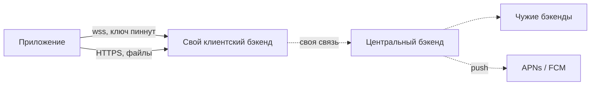
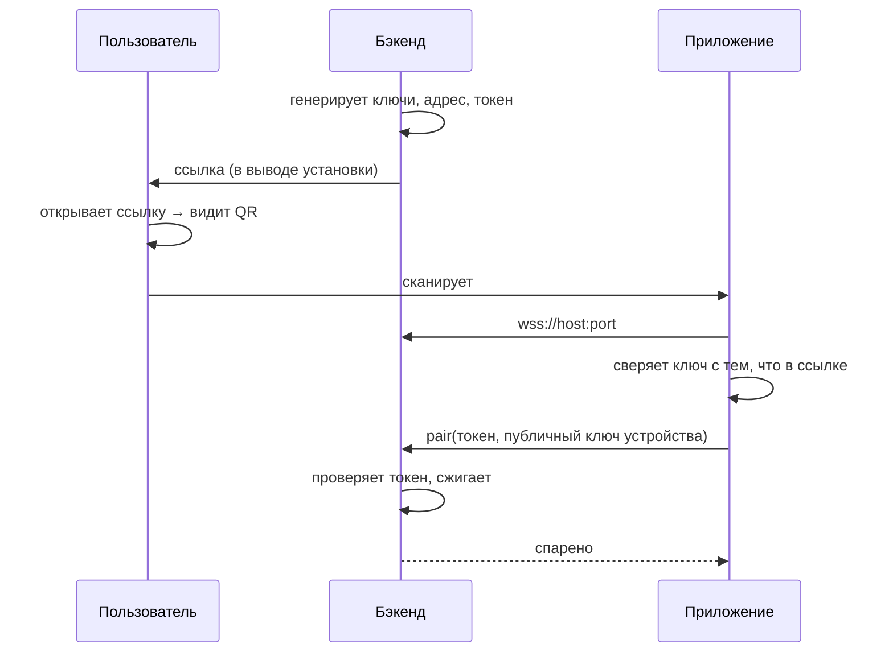
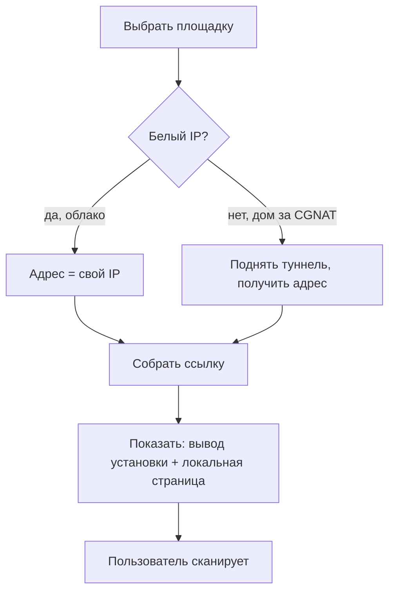

# Подключение приложения к клиентскому бэкенду

## 1. Суть

Пользователь разворачивает **свой** клиентский бэкенд — в облаке или дома. Приложение должно узнать о нём, убедиться, что это именно он, и получить право работать — **за один жест и без ввода адресов**.

Всё нужное едет в одной ссылке: адрес, публичный ключ сервера и одноразовый токен. Ссылка же и есть QR — это одна сущность в двух видах доставки.

Неснимаемое ограничение: **дома за CGNAT входящее соединение невозможно** на уровне сети провайдера. Решается на стороне бэкенда — он сам добывает себе публичный адрес, и приложение разницы не видит.

---

## 2. Из чего состоит

Легенда: 🟢 есть в проекте · 🟡 частично · 🔴 ещё нет

| Часть | За что отвечает | |
|---|---|:--:|
| Приложение | Единственный клиент. Держит сокет, пинит ключ сервера, хранит ключ устройства | 🟡 |
| Клиентский бэкенд | Принимает сообщения 24/7, хранит недоставленное, отдаёт данные приложению | 🔴 |
| Публикатор адреса | Даёт бэкенду достижимый извне адрес: белый IP или туннель | 🔴 |
| Ссылка спаривания | Адрес + ключ + одноразовый токен. Она же QR | 🔴 |
| Центральный бэкенд | Обмен с другими бэкендами и push. **Приложению неизвестен** | 🔴 |

⚠️ **Стрелок, которых нет:** приложение ↔ центральный бэкенд (адреса центра в приложении не существует), приложение ↔ чужой бэкенд, байты файлов по сокету, push через сокет.

---

## 3. Как работает спаривание

**Пароля в схеме нет.** Приватный ключ устройства рождается на телефоне и никогда его не покидает — перехватывать и утекать нечему.

---

## 4. Установка бэкенда

**Что видит пользователь:** выбрал площадку → развернул → получил ссылку → открыл в браузере → отсканировал. Ни IP, ни портов, ни ключей.

**Что происходит внутри:** генерация ключей → самоподписанный сертификат → определение адреса → одноразовый токен → сборка ссылки → ожидание спаривания. После первого claim токен сгорает, и **повторить спаривание можно только с доступом к машине**.

---

## 5. Форматы

Ссылка: `https://nox.app/p/#<base64url(payload)>`. Всё после `#` браузер на сервер не отправляет — поэтому та же страница рисует QR, а payload к нам не попадает.

| Поле | Что | Размер |
|---|---|---|
| `version` | версия формата | 1 байт |
| `flags` | тип хоста, наличие токена | 1 байт |
| `port` | порт (по умолчанию 443) | 2 байта |
| `host` | адрес | 4 / 16 / переменной |
| `server_key` | публичный ключ бэкенда | 32 байта |
| `claim_token` | одноразовый, с TTL | 16 байт |

**~75 символов** base64url — QR невысокой плотности. Id сервера отдельно не нужен, он выводится из ключа.

Дальше — постоянный WebSocket, **17 команд и 6 событий** (полный инвентарь в `docs/protocol/wire-surface.md`). Конверт пока не зафиксирован.

---

## 6. Решения

| Решение | Выбор | Почему | Пересмотреть, если |
|---|---|---|---|
| Кто кого находит | адрес в ссылке, прямое соединение | приложение не должно знать о релее | адрес перестанет быть статичным |
| Учётные данные | ключ устройства | нечего перехватить, отзыв даром | нужен вход без старого устройства |
| Доверие | пиннинг ключа из ссылки | убирает домен, ACME, продление | понадобится доступ из браузера |
| Артефакт | universal link, QR = та же ссылка | схема `nox://` без приложения даёт тупик | — |
| Транспорт | WebSocket / TLS / 443 | двунаправленный, проходит middlebox'ы | нужен backpressure |
| Файлы | отдельный HTTP | иначе блокируют сокет, нет докачки | — |
| Дом за CGNAT | туннель на стороне бэкенда | проброс портов там невозможен | — |

---

## 7. Пограничные случаи

| Случай | Что происходит |
|---|---|
| Ключ не совпал | Обрыв. Кнопки «продолжить» нет 🟢 |
| Ссылку перехватили | Кто первый — тот владелец. Короткий TTL + запрет повторного claim 🟢 |
| Токен протух | Новый выпускается с машины 🟢 |
| **IP сменился** | Спаренные устройства теряют сервер 🔴 |
| **Телефон утерян** | Ключ был только на нём 🔴 |
| **Нет камеры** | Адрес и ключ руками не набрать 🔴 |
| Бэкенд лежит | Нужно отдельное понятие «жива ли сессия» 🟡 |
| Второе устройство | Спаренное выпускает приглашение 🟡 |

---

## 8. Открытые вопросы и блокеры

| | Вопрос / блокер | На ком | Реестр |
|---|---|---|---|
| 🔴 | Где заканчивается E2EE — блокирует конверт протокола | владелец | Q1 |
| 🔴 | Публичный id автора отдельно от идентификатора входа | владелец | Q11 |
| 🟡 | Непрочитанное: устройство или сервер | владелец | Q12 |
| 🟡 | Смена IP у спаренных устройств | архитектура | — |
| 🟡 | Восстановление при утере устройства | владелец | — |
| 🟡 | Нужен ли путь без камеры | владелец | — |
| 🟢 | Приложение не знает о релее | зафиксировано | — |
| 🟢 | Площадки: облако + дом | зафиксировано | Q10 |

---

## 9. Вне скоупа

Протокол «бэкенд ↔ центр» (другой инженер) · конверт и коды ошибок (после Q1) · push (`docs/research/snikket-fit.md` §4) · файловый HTTP-канал · экономика и юридический статус оператора.
